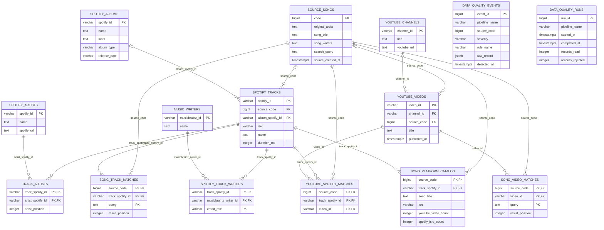

# Entity Relationship Diagram

This ERD documents the normalized PostgreSQL schema `massive_music` defined in
`data/schema.sql`. Raw Spotify and YouTube API responses remain in MongoDB and
are intentionally outside this relational diagram.

## Reporting and operations

`song_platform_catalog` is the reporting projection: one row per source song and
Spotify track with label, ISRC, artist, and cross-platform count fields. The
pipeline rebuilds it only after Spotify and YouTube metadata pass the quality
gate.

`data_quality_events` and `data_quality_runs` are operational audit tables.
They do not have foreign-key constraints because an invalid raw record can lack a
valid `source_code`; this permits reliable quarantine and diagnosis of malformed
input.

`music_writers` and `spotify_track_writers` are included because they are part of
the database schema. Their MusicBrainz enrichment task is currently disabled in
the Airflow DAG, so these tables are not populated by scheduled runs.